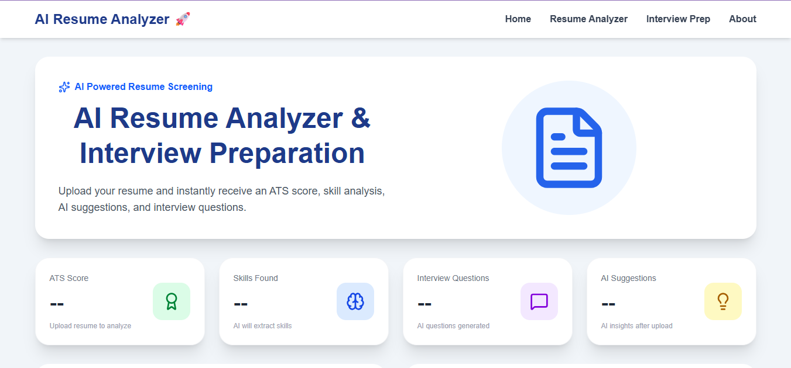
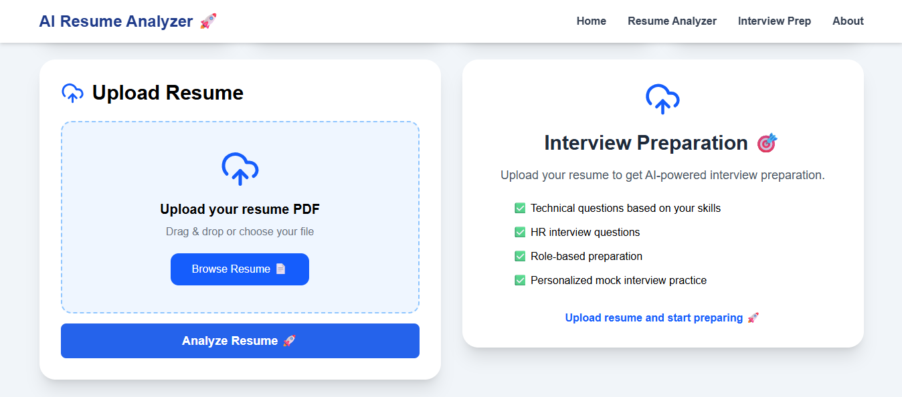
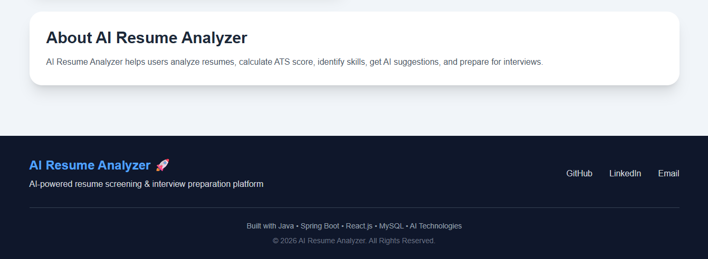

# 🤖 AI-Powered Resume Analyzer & Interview Preparation Platform


An AI-powered full-stack web application that analyzes resumes, evaluates ATS compatibility, identifies skills, provides improvement suggestions, and generates interview questions to help candidates prepare for job opportunities.

---

# 🚀 Features

## 📄 Resume Analysis

- Upload resume in PDF format
- Extract resume text automatically
- Analyze resume content using AI
- Generate ATS compatibility score

## 🎯 ATS Score Evaluation

- Resume quality evaluation
- Skill matching analysis
- Identify missing skills
- Provide improvement suggestions

## 💡 AI Resume Suggestions

- Resume improvement recommendations
- Skill gap identification
- Career improvement tips

## 🎤 Interview Preparation

- Generate interview questions based on resume
- Technical interview preparation
- Practice interview scenarios

## 🔐 User Management

- User registration
- User data management
- Secure REST API communication

---

# 🛠️ Tech Stack

## Backend

- Java
- Spring Boot
- Spring Data JPA
- REST APIs
- MySQL
- Apache PDFBox

## Frontend

- React.js
- JavaScript
- HTML5
- CSS3
- Vite

## AI Integration

- OpenAI API

## Tools

- IntelliJ IDEA
- Visual Studio Code
- Git & GitHub
- Postman

---

# 🏗️ Architecture

```text
React Frontend
        │
        ▼
     REST APIs
        │
        ▼
Spring Boot Backend
        │
        ▼
      MySQL
        │
        ▼
AI Resume Analysis Engine
```

---

# 📂 Project Structure

```text
AI-Resume-Analyzer
│
├── resume-analyzer
│   ├── controller
│   ├── service
│   ├── repository
│   ├── entity
│   └── config
│
├── resume-analyzer-frontend
│   ├── components
│   ├── api
│   ├── assets
│   └── pages
│
└── screenshots
```

---

# ⚙️ Installation & Setup

## Backend Setup

Clone the repository:

```bash
git clone https://github.com/iamharish77/AI-Resume-Analyzer.git
```

Navigate to backend:

```bash
cd resume-analyzer
```

Configure MySQL database:

```text
src/main/resources/application.properties
```

Add OpenAI API key:

```text
OPENAI_API_KEY=your_api_key
```

Run Spring Boot application:

```bash
mvn spring-boot:run
```

---

## Frontend Setup

Navigate to frontend:

```bash
cd resume-analyzer-frontend
```

Install dependencies:

```bash
npm install
```

Run React application:

```bash
npm run dev
```

---

# 📸 Screenshots

## 🏠 Home Page



---

## 📄 Resume Upload Page



---

## 🎤 Interview Preparation Page


---

## ℹ️ About Page



---

# 🔮 Future Enhancements

- AI Resume Builder
- Job Description Matching
- LinkedIn Profile Analysis
- Voice-based Mock Interviews
- Career Recommendation System

---

# 👨‍💻 Developer

**Harish S**

Java Full Stack Developer

GitHub:

https://github.com/iamharish77

Likedin:

https://www.linkedin.com/in/iamharish77/
